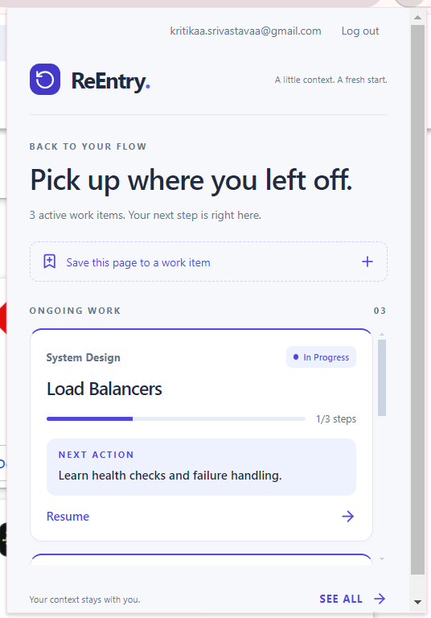
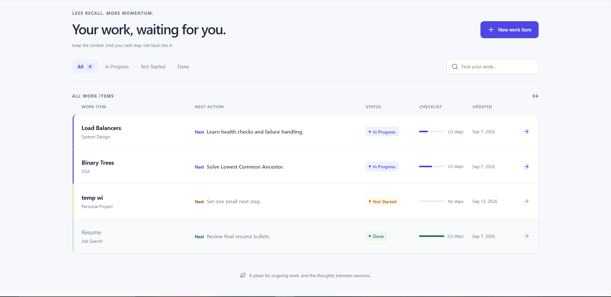
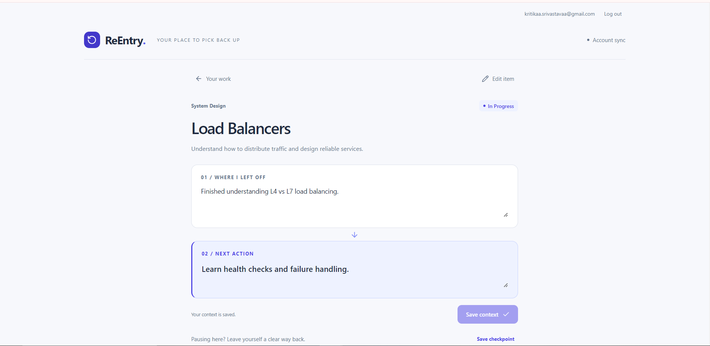
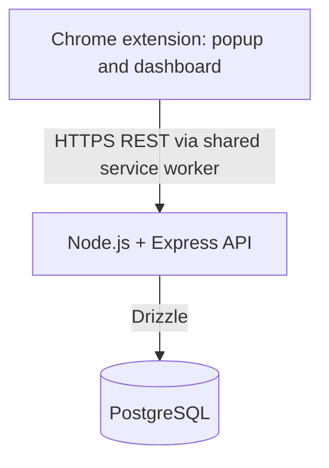

# ReEntry

**A full-stack Chrome extension that remembers where you stopped, what comes next,
and the browser workspace you need to resume.**

Switching away from ongoing work often means reconstructing it later: finding
pages, remembering your last thought, and deciding what to do next. Task managers
remember what needs doing; bookmarks remember where resources are. ReEntry keeps
your work, stopping context, next action, and working resources together.

### Quick resume from the browser



### Your work at a glance



### Pick up exactly where you stopped



## Why ReEntry?

A work item is something you will leave and return to: interview preparation,
a coding problem, a research topic, or a personal project. Knowing its title is
not enough to resume it. ReEntry answers: **Where was I, what should I do next,
and which pages do I need to reopen?**

## Core experience

1. Create a work item with a goal and work normally.
2. Record **Where I Left Off** and one concrete **Next Action**.
3. Use **Save Workspace** to select the browser tabs that belong to the work.
4. **Save checkpoint** when stopping to preserve your context and progress history.
5. Return through the popup or dashboard, review your context, and press **Resume Work**.
   Selected saved URLs reopen in the current window; already-open URLs are skipped.

## Features

| Area              | What it provides                                                                                                           |
| ----------------- | -------------------------------------------------------------------------------------------------------------------------- |
| Context           | Where I Left Off, Next Action, checkpoints, and newest-first Recent progress                                               |
| Workspace         | Selected tab capture, URL restoration, duplicate handling, and Save to ReEntry for individual pages or links               |
| Organization      | Categories, status, checklists, resources, search, filters, and active-first inventory ordering                            |
| Accounts and sync | Email/password authentication, per-user PostgreSQL persistence, and shared data across profiles/devices using the same API |

The popup keeps compact cards for active work. SEE ALL opens a compact inventory;
selecting a row goes directly to its full context. In Progress items appear before
Not Started and Done, with the most recently updated first within each status.

## Architecture



| Layer     | Stack                                              |
| --------- | -------------------------------------------------- |
| Extension | React, TypeScript, Vite, Chrome Manifest V3        |
| API       | Node.js, Express, TypeScript, Zod                  |
| Data      | PostgreSQL, Drizzle, node-postgres                 |
| Hosting   | One Render API service and one PostgreSQL database |

The popup and full dashboard share the same API and model. PostgreSQL is the
canonical store for authenticated work. Chrome local storage retains session
state and V1 migration input, not an independent permanent work database.

## Engineering Decisions

- **Local to server persistence:** V1 used Chrome storage to prove the product.
  Moving authenticated work to PostgreSQL enabled access across profiles/devices.
- **Retry-safe migration:** retained V1 data has stable source IDs and server receipts.
  Imports are bound to their original account and completed only after successful writes.
- **Server-side ownership:** every work, checklist, resource, and checkpoint operation
  verifies ownership; supplying another user's ID cannot bypass authorization.
- **Simple synchronization:** successful writes notify extension views. Focus refresh
  and a 15-second visible-view poll pick up changes from other profiles. Slow refreshes
  are coalesced rather than building an offline write queue.
- **Selected workspace capture:** tab titles/URLs are read only on an explicit action
  after optional permission is granted. Only selected pages are sent to the API.
- **Consistent checkpoints:** a transaction updates current context, optional workspace
  resources, and history together. Stable attempt IDs prevent duplicate checkpoint saves.
- **Proportionate retries:** work-item creation and imports have receipts; URL saves
  deduplicate per work item. Not every write is interchangeable or automatically retried.

## Security & Reliability

Passwords are bcrypt-hashed with cost 12. JWTs expire after seven days and require
an unexpired, revocable database session. Payload validation, exact-origin CORS,
rate limiting, and user-scoped routes protect the API. Secrets come from ignored
environment files locally and Render environment variables when hosted.

Tokens stay in the extension background service and trusted extension storage;
Chrome profile storage is not an encrypted credential vault. Authentication drafts
use memory-only session storage. There are no content scripts or history API calls.
Required permissions are `storage`, `activeTab`, `contextMenus`, and the configured
API host. Optional `tabs` access enables selected workspace capture and duplicate
checks; see [Chrome's permission model](https://developer.chrome.com/docs/extensions/reference/api/tabs).

Only HTTP(S) resources without embedded credentials are accepted. Network/session
failures produce explicit errors; failed checkpoint saves retain the open form.
The hosted request timeout allows for a slow first response. These are implemented
protections and a source-level review, not a penetration-test certification.

## Local Development

Prerequisites: Node.js 22 (matching Render), npm, PostgreSQL 14+, and desktop Chrome
102+. PostgreSQL integration is tested with PostgreSQL 18. No Docker is required.

```sh
git clone https://github.com/kritikaa-srivastavaa/ReEntry.git
cd ReEntry
npm ci
cd server
npm ci
cd ..
```

1. Configure a local database and `server/.env` using the safe placeholders in
   [server/.env.example](server/.env.example). Set `DATABASE_URL`, a random
   `JWT_SECRET`, and `CORS_ORIGINS`. Copy the root [.env.example](.env.example) to
   `.env` for the client API URL. Keep existing environment files when updating.
2. In `server/`, run `npm run db:migrate`, then `npm run dev`.
3. From the root, run `npm run build`.
4. Open `chrome://extensions`, enable Developer mode, and **Load unpacked** from `dist`.
   Add that extension's exact `chrome-extension://ID` origin to the backend CORS
   configuration, restart the API, and reopen ReEntry.

[Full setup](docs/DEVELOPMENT.md) includes exact PostgreSQL commands, the optional
Windows managed-cluster helper, API reference, and migration details. Preserve
the same `dist` folder/extension ID when reloading an existing installation.
`npm run dev` serves the browser dashboard; tab capture/resume requires the extension.

## Testing

Final validation on 2026-09-13: **14 frontend tests and 11 PostgreSQL API scenarios
passed**, along with frontend/backend TypeScript, formatting, and production builds.
Current evidence and audit scope are recorded in [release readiness](docs/RELEASE.md).

Coverage includes model/UI behavior, authentication, ownership, CRUD, V1 migration,
workspace selection and restoration, URL validation/deduplication, checkpoint
ordering/retries, resource behavior, and failed-save draft preservation.

```sh
# Repository root
npm test
npm run typecheck
npm run format:check
npm run build

# server/ (Windows isolated PostgreSQL runner)
npm run test:isolated
npm run typecheck
npm run build
```

For other systems, [configure a test database](docs/DEVELOPMENT.md#automated-checks)
and run `npm test` inside `server/`. The API suite creates and removes only its own
isolated database. There is no separate ESLint configuration.

## Production Demo

The extension connects over HTTPS to the Render API and PostgreSQL. The public
[API health endpoint](https://reentry-api-5jfm.onrender.com/api/health) returns
`{"status":"ok"}` when the API and database are reachable; it is not a separate
web application. The dashboard belongs to the extension.

For a hosted build, configure `VITE_API_URL` and `VITE_API_TIMEOUT_MS` in an ignored
`.env.hosted.local`, run `npm run build:hosted`, and reload `dist`. Every device must
use the same API and have its extension origin allowed. [Deployment setup](DEPLOYMENT.md)
explains the existing Blueprint, migrations, and environment variables.

The free Render demo can sleep on inactivity, and its free PostgreSQL database
expires after 30 days without managed backups. It is a portfolio demo, not a
promise of permanent availability. [Provider limits](https://render.com/docs/free)

## Project Evolution

| Milestone                     | Focus                                                                         |
| ----------------------------- | ----------------------------------------------------------------------------- |
| V1 - Product MVP              | Chrome extension, local persistence, context-aware work items                 |
| V2 - Full-stack persistence   | REST API, PostgreSQL, authentication, migration, sync                         |
| V2.1 - Production reliability | Deployment, cross-device and ownership verification, network failure handling |
| V3 - Context resumption       | Save Workspace, Resume Work, checkpoints, Recent progress                     |
| v1.0.0 - Portfolio release    | Feature-complete presentation and release-readiness pass                      |

**ReEntry v1.0 is feature complete.** V1-V3 established the product experience,
full-stack persistence, deployment, and workspace resumption workflow. This
repository is maintained as a completed portfolio project. The `v1.0.0` GitHub
release is prepared for review; no release tag has been created.
